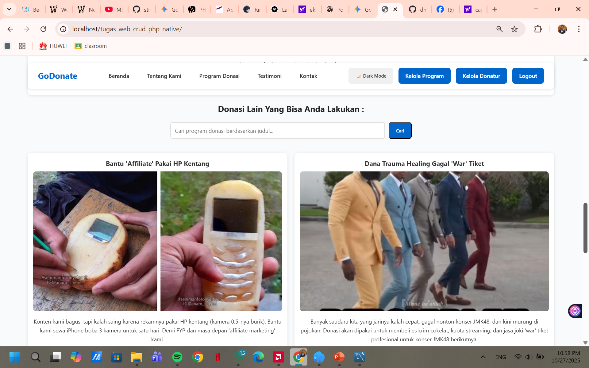

# GoDonate - Aplikasi CRUD PHP Native

GoDonate adalah aplikasi web donasi sederhana yang dibangun menggunakan PHP Native (PHP 8+). Proyek ini dirancang sebagai aplikasi full-stack yang mengimplementasikan fungsionalitas CRUD (Create, Read, Update, Delete) ganda untuk **Program Donasi** dan **Donatur/Testimoni**.

Aplikasi ini mencakup halaman publik untuk melihat program donasi dan area admin yang dilindungi kata sandi untuk mengelola kedua modul data tersebut.

---

* **Created by**  : Dimas Elang Satria
* **NIM**         : 2409106027
* **Kelas**       : Informatika A 2024

## Fitur Tersedia

Aplikasi ini memenuhi semua spesifikasi teknis dan fitur tambahan yang telah dibuat:

* **Autentikasi**:
    * Sistem Login & Logout admin menggunakan PHP Session.
    * Semua halaman admin (`dashboard.php`, `kelola_donatur.php`, `tambah.php`, dll.) dilindungi dan akan mengarahkan pengguna ke halaman login jika diakses tanpa sesi.

* **CRUD Program Donasi**:
    * **Create**: Form tambah program donasi baru (`tambah.php`).
    * **Read**: Halaman utama (`dashboard.php`) untuk melihat, mencari, dan mem-pagination semua program.
    * **Update**: Form edit data (`edit.php`) dengan *prefill* data lama.
    * **Delete**: Fungsi hapus data (`hapus.php`) dengan konfirmasi.
    * **Upload Gambar**: Admin dapat meng-upload gambar sampul untuk program (disimpan di `/uploads/`).
    * **Fitur "Pin"**: Admin dapat memilih satu program donasi untuk "Jadikan Utama" (`feature.php`) yang akan tampil di bagian atas `index.php`.

* **CRUD Donatur / Testimoni**:
    * **Create**: Form tambah donatur baru (`tambah_donatur.php`).
    * **Read**: Halaman admin (`kelola_donatur.php`) untuk melihat, mencari, dan mem-pagination semua donatur.
    * **Update**: Form edit data donatur (`edit_donatur.php`).
    * **Delete**: Fungsi hapus data donatur (`hapus_donatur.php`).
    * **Upload Foto**: Admin dapat meng-upload foto donatur (disimpan di `/uploads/donatur/`).

* **Fitur Halaman Publik**:
    * Menampilkan "Donasi Utama" secara dinamis berdasarkan pilihan admin.
    * Menampilkan "Testimoni" secara dinamis dari data di tabel `donatur`.
    * Daftar donasi dengan pencarian dan pagination.
    * Halaman detail (`detail.php`) untuk setiap program donasi.

* **Keamanan**:
    * Koneksi database wajib menggunakan **PDO (PHP Data Objects)**.
    * Penggunaan **Prepared Statements** di *semua* query (SELECT, INSERT, UPDATE, DELETE) untuk mencegah **SQL Injection**.
    * Penggunaan `htmlspecialchars()` pada semua output data (echo) untuk mencegah **XSS (Cross-Site Scripting)**.
    * Validasi file upload (tipe/MIME, ukuran) di sisi server.
    * Penanganan error `try...catch` yang tidak menampilkan *stack trace* ke pengguna.

* **User Experience (UX)**:
    * **Dark Mode**: Fungsionalitas Dark Mode yang konsisten di semua halaman (publik dan admin) menggunakan `localStorage`.
    * **CSS Auto-Crop**: Tampilan gambar yang seragam (`object-fit: cover`) untuk foto program dan foto donatur.

---

## Kebutuhan Sistem

* **Bahasa**: PHP 8.0 (atau lebih baru)
* **Database**: MySQL atau MariaDB
* **Server Lokal**: Laragon (Direkomendasikan) atau XAMPP
* **Web Browser**: Chrome, Firefox, atau browser modern lainnya

---

## Cara Instalasi dan Konfigurasi

1.  **Clone atau Download Proyek**
    * Unduh file ZIP atau clone repositori ini ke *root directory* server lokal Anda (misal: `C:/laragon/www/tugas_web_crud_php_native`).

2.  **Buat Database**
    * Nyalakan server MySQL Anda (via Laragon atau XAMPP).
    * Buka *database client* Anda (MySQL Workbench, phpMyAdmin).
    * Buat database baru dengan nama `godonate_db`.

3.  **Impor Tabel**
    * Di dalam database `godonate_db`, jalankan kueri SQL berikut untuk membuat 3 tabel yang diperlukan: `users`, `program_donasi`, dan `donatur`.

    ```sql
    USE godonate_db;

    -- 1. Tabel untuk Admin
    CREATE TABLE IF NOT EXISTS users (
      id INT AUTO_INCREMENT PRIMARY KEY,
      username VARCHAR(100) NOT NULL UNIQUE,
      password VARCHAR(255) NOT NULL,
      created_at TIMESTAMP DEFAULT CURRENT_TIMESTAMP
    );

    -- 2. Tabel untuk Program Donasi
    CREATE TABLE IF NOT EXISTS program_donasi (
      id INT AUTO_INCREMENT PRIMARY KEY,
      judul VARCHAR(255) NOT NULL,
      deskripsi TEXT NOT NULL,
      target_donasi BIGINT NOT NULL,
      terkumpul BIGINT NOT NULL DEFAULT 0,
      gambar VARCHAR(255) NULL,
      created_at TIMESTAMP DEFAULT CURRENT_TIMESTAMP,
      is_featured TINYINT NOT NULL DEFAULT 0 COMMENT '1 = Jadi donasi utama, 0 = Normal'
    );

    -- 3. Tabel untuk Donatur (Testimoni)
    CREATE TABLE IF NOT EXISTS donatur (
      id INT AUTO_INCREMENT PRIMARY KEY,
      nama VARCHAR(255) NOT NULL,
      jumlah_donasi BIGINT NOT NULL DEFAULT 0,
      pesan_singkat TEXT NULL,
      foto VARCHAR(255) NULL COMMENT 'Nama file foto donatur',
      created_at TIMESTAMP DEFAULT CURRENT_TIMESTAMP
    );

    -- Memasukkan data admin awal (username: admin, password: 12345)
    INSERT INTO users (username, password)
    VALUES ('admin', '$2y$10$Y.9X.qg.L5g.i.q.K.O.i.o.E.j.e.S.r.D.d.R.o.S.l.f.S.g.F.u');
    ```

4.  **Konfigurasi Koneksi (Contoh Environment)**
    * Buka file `config/database.php`.
    * Sesuaikan pengaturan koneksi dengan *environment* Anda (setting default Laragon/XAMPP biasanya sudah sesuai).

    ```php
    // Lokasi: config/database.php
    $host = '127.0.0.1'; // atau 'localhost'
    $db   = 'godonate_db'; // Nama database Anda
    $user = 'root';       // Username database Anda
    $pass = '';           // Password database Anda (kosong jika pakai Laragon/XAMPP default)
    ```

5.  **Jalankan Aplikasi**
    * Akses proyek melalui browser Anda (misal: `http://localhost/POSTTEST_4/`).
    * Login admin dapat diakses di `/login.php` dengan kredensial:
        * **Username**: `admin`
        * **Password**: `12345`

---

## Struktur Folder
```
tugas_web_crud_php_native/
├── config/
│   └── database.php
├── uploads/
│   ├── donatur/
│   │   └── (File foto donatur akan tersimpan di sini)
│   └── (File gambar program akan tersimpan di sini)
│
├── assets/
│   ├── ss1.jpg
│   ├── ss2.jpg
│   ├── ss3.png
│   └── video.mp4
│
├── dashboard.php
├── detail.php
├── edit.php
├── edit_donatur.php
├── feature.php
├── hapus.php
├── hapus_donatur.php
├── index.php
├── kelola_donatur.php
├── login.php
├── logout.php
├── navigation.php
├── README.md
├── script.js
├── style.css
├── tambah.php
└── tambah_donatur.php
```

## Screenshot Aplikasi


